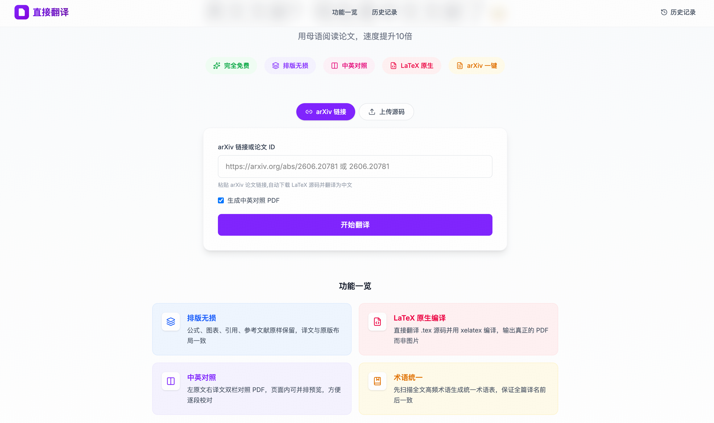
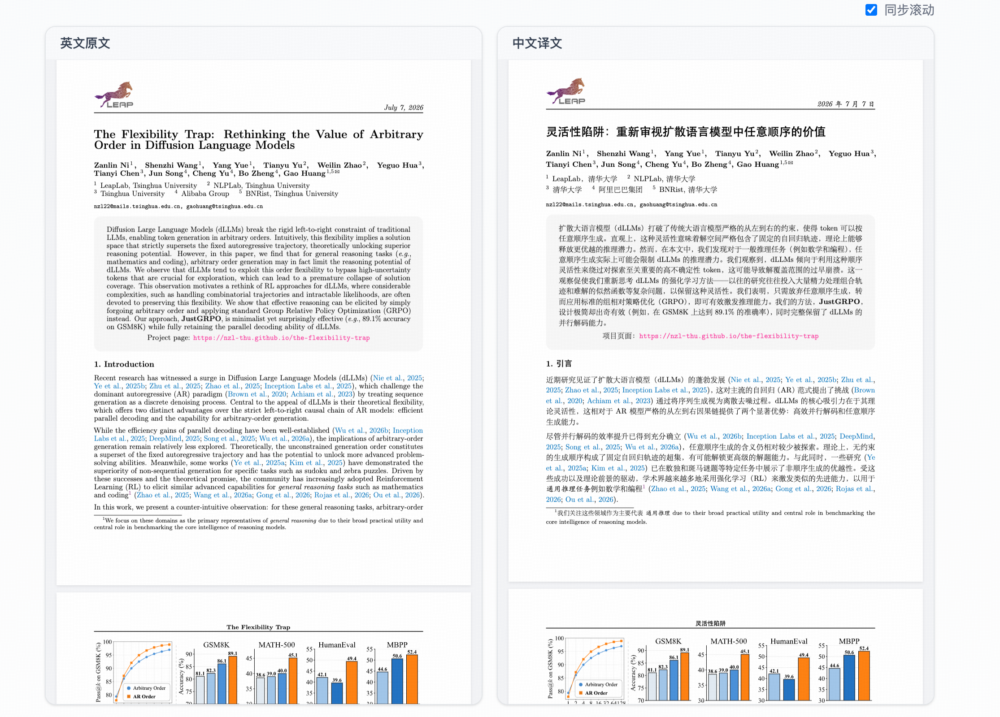
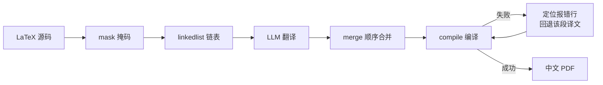
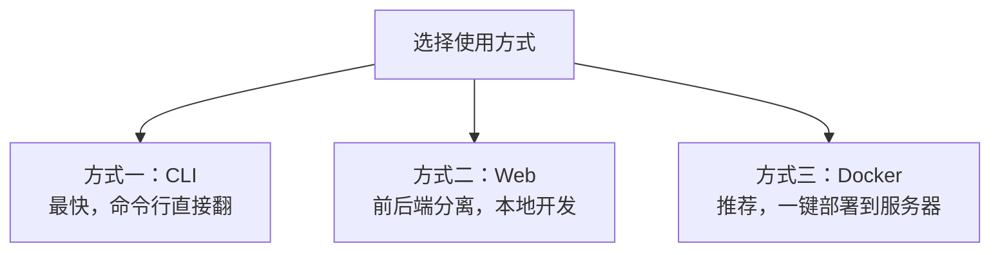

# 直接翻译 · TransTeX

<p align="center">
  <b>把 arXiv 英文论文一键翻译成中文 PDF —— 公式、图表、引用、LaTeX 排版原样保留，译文如同原版。</b>
</p>

<p align="center">
  <a href="./LICENSE"></a>
  
  
  
  
</p>

> **直接翻译**（对外中文名）· 代号 **TransTeX**（仓库 / 包名）。
> 名字取「译文如同原版」——排版不变、公式不乱、引用不丢，翻译不走样。

传统「机翻」把论文丢进翻译器，出来的是一堆断裂的文字：公式没了、图表错位、引用变成乱码。TransTeX 直接翻译 **LaTeX 源码**，用二值掩码精确区分「该翻的正文」和「必须原样保留的命令 / 公式 / 引用」，再重新编译成 PDF —— 你读到的仍是那篇论文本来的样子，只是换成了中文。

---

## 界面预览

**首页** —— 粘贴 arXiv 链接或上传源码，一键开始翻译



**中英对照** —— 左原文、右译文并排同步滚动，逐段核对译文



---

## 功能一览（⭐ = 核心特性）

| 功能 | 描述 |
|---|---|
| ⭐ **排版无损翻译** | 直接翻译 LaTeX 源码，公式、图表、`\cite`、表格、章节结构完整保留 |
| ⭐ **不会翻坏** | 二值掩码 + 链表顺序合并，无「段落编号」协议 → 从原理上杜绝整篇错位 |
| ⭐ **编译自愈** | 编译失败时自动定位报错行、回退该段译文再重编，最多 32 轮 |
| **arXiv 一键翻译** | 输入 arXiv 链接或 ID，自动下载源码 → 翻译 → 编译 → 出 PDF |
| **本地源码翻译** | 上传 `.zip` / `.tar.gz` 源码包，或直接指向本地目录 |
| **中英对照** | 可选生成中英双栏对照 PDF，便于核对 |
| **实时进度** | Web 端 WebSocket 实时推送下载 / 翻译 / 编译各阶段进度 |
| **多模型** | 内置 Kimi、OpenAI，provider 抽象可扩展 |
| **断点续传** | 分段缓存，中断后重跑跳过已译内容，省时省 token |
| **PDF 水印** | 译文每页左上角可加图片水印（可关） |
| **一键部署** | Docker Compose 打包 TeXLive + 中文字体 + 前后端，服务器直接起 |

---

## 它是怎么做到「不翻坏」的

旧方案常用「编号回填」：把段落编号发给 LLM，再按编号找回位置 —— 模型一漏号，整篇就错位，还得靠一堆事后修复脚本补救。TransTeX 改用 **二值掩码**，翻译内核只有四步：



1. **mask** —— 给源码每个字符标记「翻译 / 保护」。公式、命令、`\cite`、图表、注释一律保护；`\caption` / `\abstract` / `\section` 的**花括号内部**挖回翻译。
2. **linkedlist** —— 转成交替的「保护段 / 翻译段」链表；翻译段边界的空白归还相邻保护段，根治 `\quad Kernel → \quadKernel` 这类命令粘连。
3. **merge** —— 按链表**顺序**拼回，没有编号 → 对齐崩坏在协议层面就不可能发生。每段做安全校验（命令数不符 / 括号不平 → 自动回退原文）。
4. **compile** —— 编译失败时从 `.log` 提取报错行号，把命中的译文段回退成原文再重编译（最多 32 轮），逐步逼近可编译状态。

---

## 安装与使用

三种方式，按需选择：



### 前置依赖

- **Python 3.11+**
- **XeLaTeX**（`xelatex` / `bibtex` / `latexmk`）与**中文字体**（推荐 Noto CJK）
- **Node.js 18+**（仅 Web / 前端需要）
- **翻译 API Key**：`export KIMI_API_KEY=...`（或 `OPENAI_API_KEY` + `TEXTRANS_PROVIDER=openai`）

> Docker 方式无需在本机安装 TeXLive / 字体 / Node —— 全部打包在镜像里。

### 方式一：CLI（最快）

```bash
pip install -r requirements.txt

# arXiv ID 或链接
python3 -m textrans 2606.20781 --provider kimi

# 本地源码目录，不生成中英对照
python3 -m textrans ./mysource --no-bilingual

# 只导出掩码可视化 HTML（调试用，不翻译）
python3 -m textrans ./mysource --debug-mask
```

<details>
<summary>全部 CLI 参数</summary>

| 参数 | 说明 |
|---|---|
| `source` | arXiv 链接 / ID，或本地源码目录（必填） |
| `--provider` | LLM provider（`kimi` / `openai`） |
| `--workers` | 并发翻译线程数（默认 8） |
| `--workdir` | 工作目录 |
| `--lang` | 目标语言（默认 简体中文） |
| `--no-bilingual` | 不生成中英对照 PDF |
| `--no-cache` | 禁用断点续传缓存 |
| `--watermark <path>` | 指定水印图片（默认用项目内 `dt.l.png`） |
| `--no-watermark` | 不添加水印 |
| `--debug-mask` | 导出掩码可视化 HTML 后退出 |

</details>

### 方式二：Web（前后端本地开发）

```bash
pip install -r requirements.txt
cd transtex-web && npm install && cd ..

# 终端 1：后端
python3 -m uvicorn textrans_api.main:app --port 8000

# 终端 2：前端（已代理 /api、/ws 到 8000）
cd transtex-web && npm run dev

# 浏览器打开 http://localhost:3000
```

### 方式三：Docker（推荐，一键部署到服务器）

```bash
cp .env.example .env        # 填入 KIMI_API_KEY
docker compose up -d --build
# 首次构建含完整 TeXLive，约 10–20 分钟；之后秒起
# 浏览器打开 http://localhost/         （nginx 单一入口，默认 80 端口）
```

架构：`nginx`（唯一对外入口）→ `/` 转前端、`/api` `/ws` 转后端。翻译产物持久化在宿主 `./data/`，重启不丢、缓存续用。

<details>
<summary>服务器部署要点</summary>

- **换端口**：改 `docker-compose.yml` 里 nginx 的 `ports`（如 `"8080:80"`）。
- **上 HTTPS**：在 nginx 前再挂一层带证书的网关，或改 `nginx.conf` 加 443。
- **产物备份**：`./data/` 目录即全部翻译结果与缓存。
- **运维**：停止 `docker compose down`；查日志 `docker compose logs -f backend`。

</details>

---

## API

后端启动后，交互式文档见 `/docs`。

| 方法 | 路径 | 说明 |
|---|---|---|
| `POST` | `/api/tasks` | 提交任务（`{arxiv_url, make_bilingual, provider}`） |
| `POST` | `/api/tasks/upload` | 上传 `.zip` / `.tar.gz` 源码包 |
| `GET` | `/api/tasks/{id}` | 查询任务状态 |
| `GET` | `/api/tasks/{id}/download/{translated\|bilingual}` | 下载 PDF |
| `WS` | `/ws/{id}` | 实时进度流 |

---

## 项目结构

```
textrans/          翻译内核（MIT）—— 二值掩码 + 链表 + 顺序合并
  core/            mask · linkedlist · split · merge · fix · compile · pdf · cache · pipeline
  llm/             多模型抽象（kimi / openai，可扩展）· 术语表 · prompts
  latexutil/       arXiv 下载 · 中文字体注入 · cls 修复 · PDF 水印
textrans_api/      FastAPI 后端 —— REST + WebSocket 进度 + PDF 下载
transtex-web/      Next.js 前端 —— arXiv 链接 / zip 上传 · 实时进度 · 结果下载
```


## 许可证

本项目采用 **MIT** 许可证，见 [LICENSE](./LICENSE)。


<p align="center">
  如果这个项目帮到了你，欢迎 ⭐ Star 支持一下。
</p>

## 参考项目
*  [gpt_academic](https://github.com/binary-husky/gpt_academic)
